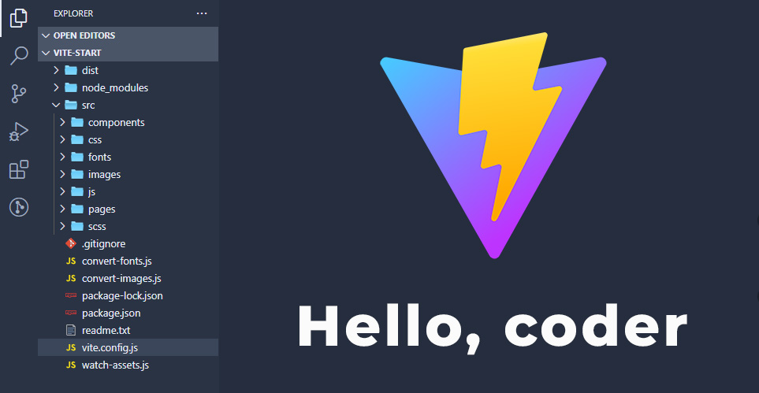

# VITE-VANILLA-START

## ПРО ЗБІРКУ

- Автор: Андрій Овчаров;
- Дата збірки: 09.06.2025;
- **Збірка "Vite-vanilla-start"** — це сучасний інструмент для веброзробників, який прискорює створення вебсайтів за макетами Figma завдяки модульній структурі, інтеграції Vite та набору плагінів для оптимізації активів. Збірка забезпечує швидку розробку, автоматизацію обробки зображень, шрифтів, стилів і скриптів, а також live-режим із автоматичним оновленням.

**Збірка підтримує:**

- Vite: 5.4.0
- npm: 11.1.0
- Node.js: 22.14.0 (LTS)


## ЗБІРКА ДОЗВОЛЯЄ:

- Конвертувати файли стилів .scss у .css із підтримкою автопрефіксерів (autoprefixer), стисненням (cssnano) та сучасними CSS-функціями (postcss-preset-env).
- Мініфікувати файли .css, .js та зображення для зменшення розміру.
- Для скидання стилів браузера використовується мій [optimize.css](https://github.com/ovcharovcoder/optimize.css).
- Розробляти вебсайт у live-режимі з автоматичним оновленням сторінок завдяки Vite Dev Server.
- Конвертувати зображення .png та .jpg у формати .webp і .avif за допомогою vite-plugin-image-optimizer.
- Оптимізувати файли .svg і зберігати їх у окремій папці images/icons.
- Конвертувати шрифти .ttf та .otf у .woff і .woff2 за допомогою скрипта convert-fonts.js.
- Використовувати модульну структуру проєкту з компонентами HTML (header.html, footer.html) для повторного використання.
- Автоматизувати обробку активів (зображень, шрифтів) за допомогою скриптів convert-images.js і watch-assets.js.
- Генерувати папку dist для зручного розгортання на хостингу.
- Показувати детальні логи для діагностики шляхів і обробки активів.

ПІДГОТОВКА ТА РОБОТА ЗІ ЗБІРКОЮ:
----------------------------------------------------
1. Встановити/оновити до останньої версії Node.js: (^22.14.0)
2. Встановити npm пакетний менеджер
3. Розгорнути стартову збірку: ```npm i``` (або ```npm install```)
4. Запуск проєкту: ```npm run dev```
5. Завершити роботу проєкту: Ctrl+C
6. Збірка фінального проєкту у папку /dist: ```npm run build```


## СТРУКТУРА ЗБІРКИ:
```
src/
|-- components/
|   |-- header.html
|   |-- footer.html
|
|--css/
|   |-- main.css
|
|-- fonts/
|   |-- src/
|   
|-- images/
|   |-- icons/
|   |-- src/
|
|-- js/ 
|   |-- main.js 
|   |-- scripts.js 
|   
|-- pages/
|   |-- index.html
|   |-- about.html
|
|-- scss/
    |--_fonts.scss
    |--_global.scss
    |--_main.scss
    |--_media.scss
    |--_mixins.scss
    |--_vars.scss
    |--_optimize.scss
    |--style.scss
   
.gitignore
convert-fonts.js 
convert-images.js 
package.json
vite-config.js
watch-assets.js
readme.txt
```


## РОБОТА З ФАЙЛАМИ ПРОЄКТУ

 **Робота із зображеннями**

Зберігайте вихідні зображення (.png, .jpg) у папці src/images/src. Зображення автоматично конвертуються у .webp і .avif під час виконання npm run build. SVG-іконки зберігайте в src/images/icons. Вони оптимізуються та копіюються до dist/images/icons без конвертації. Після обробки зображення потрапляють до dist/images/ або dist/images/icons/.

 **Робота зі шрифтами**

Зберігайте вихідні шрифти (.ttf, .otf) у папці src/fonts/src, вони будуть конвертовані у woff, woff2 та зберігаються у src/fonts.

**Робота з html**

Проєкт має модульну будову, тому всі файли .html варто зберігати у папці src/pages, а їх компоненти (header.html, footer.html та ін) - у папці src/components.

**Робота зі стилями**

Файли .scss варто зберігати у папці src/scss

**Pобота зі скриптами**

Файли .js варто зберігати у папці src/js.


## ПЕРЕВІРКА РОБОЧОГО СТАНУ ЗБІРКИ:

1. Встановіть node.js та npm (якщо відсутні) або оновіть їх до останньої версії.
2. Розпакуйте архів із проєктом.
3. Виконайте команду для встановлення залежностей: npm i
4. Запустіть розробку: npm run dev
5. Відкрийте http://localhost:3000 у браузері.

   + Якщо виводиться повідомлення (див. нижче), це означає, що збірка працює коректно.



## ☕ Сподобалась збірка? 
Пригостіть автора кавою через [PayPal](https://www.paypal.com/donate/?business=datoshcode@gmail.com)

 ## Ліцензія

<a href="LICENSE">MIT LICENSE</a>


